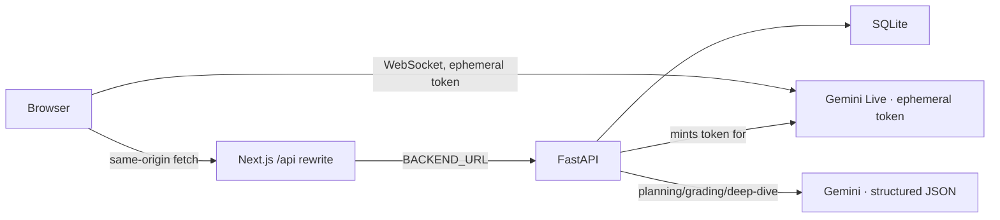

# InterviewPilot Architecture

Status: current as of 2026-09-18, branch `main`. This document describes the implementation as it exists in code, not aspirational design. See the [README](README.md#-known-limitations--roadmap) for known gaps.

## 1. System overview



Two distinct paths leave the browser:

1. **Live voice conversation** — the browser opens a WebSocket **directly** to `wss://generativelanguage.googleapis.com/.../BidiGenerateContentConstrained`, authenticated with a single-use ephemeral token minted by the backend. Audio never transits the FastAPI server.
2. **Everything else** (session, plan, analyze, deep-dive, history) — same-origin `fetch("/api/...")` calls, rewritten by Next.js (`next.config.mjs`) to `BACKEND_URL` (default `http://127.0.0.1:8000`), which is a **server-only** environment variable — it is never bundled into client JS.

The permanent `GEMINI_API_KEY` lives only in `backend/.env` and is used server-side for: minting Live ephemeral tokens, question planning, grading, and deep-dive generation.

## 2. Frontend

### Screens (`app/page.tsx`)

A single client component (`InterviewPilot`) owns a state machine: `setup → interview → processing → results`, plus a `review` state for a pending (unanalyzed) interview recovered from `sessionStorage` or history.

- **Setup** — `SetupScreen` collects `{ role, style, vibe, difficulty, num_questions }` plus optional resume text (PDF/`.txt` upload via `POST /api/resume` or paste) and calls `POST /api/plan`.
- **Interview** — `InterviewScreen` owns the live session (`useLiveAPI`) and camera tracking (`useFaceTracker`) and renders the live HUD.
- **Processing** — a spinner while `POST /api/analyze` runs.
- **Results** — `ResultsScreen` renders per-question grades/evidence/feedback, speech/camera metrics, strengths/improvements, and on-demand deep-dive drills (`POST /api/deepdive`).
- **Review** — shown when a draft exists but has no result yet (failed/never-attempted analysis); lets the user retry `analyze()` without repeating the interview.

Startup calls a single-flight `initialize()`: it checks `GET /api/session`, creates a session via `POST /api/session` if needed (prompting for an access code if the backend requires one), refreshes history, and restores any pending draft from `sessionStorage`. Overlapping calls (e.g. React Strict Mode's double-invoked effect) share one in-flight promise instead of issuing two `POST /api/session` calls that could otherwise mint two different session cookies.

`analyze()` treats history refresh as best-effort: a successful analysis always lands on the Results screen and stays there even if the subsequent history-list refresh fails (a toast reports the refresh failure separately). Only a failed draft-save/analyze call routes back to Review.

### `useLiveAPI.ts` — Gemini Live session

- Requests a token via `getLiveToken()` (`POST /api/live-token`), opens the WebSocket, and sends a `setup` message with a `systemInstruction`, `responseModalities: ["AUDIO"]`, `inputAudioTranscription`/`outputAudioTranscription`, and two function tools: `set_question(question_index)` and `end_interview()`.
- `InterviewRecording` (`app/lib/interviewRecording.ts`) accumulates per-question `{ text, asked, speaking_seconds }`. `markQuestion()` only accepts the current or next index (rejecting skips/backtracking) so a model error can't silently misattribute an answer; repeats are idempotent.
- Mic audio is captured via `ScriptProcessorNode`, resampled to 16kHz, and streamed as base64 PCM. `activeAudioSeconds()` (`app/lib/speechMetrics.ts`) excludes silent buffers and buffers captured while interviewer audio is still playing back, so "speaking seconds" only counts the candidate.
- Model audio chunks are decoded and scheduled back-to-back via `playPcm16()` (`app/lib/audioUtils.ts`), tracked in a `Set` so an interruption (`content.interrupted`) can stop all queued sources.
- **Drain-then-stop (`finishSession`)**: both automatic completion (the model calls `end_interview`) and manual "Finish" go through the same helper — wait ~1.5s (grace period for trailing transcription/audio), then poll until queued playback has actually finished, then tear down. This means a manual Finish click does not truncate a transcript chunk that was still in flight, matching automatic completion's behavior.
- `stopSession()` (immediate teardown, used for "Cancel connection" and unmount) fully releases the socket, audio contexts, processor/source/gain nodes, mic tracks, and pending timers, and is idempotent. The recorded transcript survives `stopSession()`/disconnect — only starting a **new** interview resets it, so an unexpected disconnect still leaves a savable/retryable recording.
- Pending mic-permission promises that resolve after cancellation immediately stop the returned tracks.

### `useFaceTracker.ts` — camera tracking

- Lazily loads `@mediapipe/tasks-vision` (WASM pinned to `0.10.33` in `next.config`-adjacent CDN URL, matching the npm package version) and runs `FaceLandmarker` in `VIDEO` mode, throttled to one inference per ~200ms via `requestAnimationFrame`.
- Every asynchronous stage after the camera stream is acquired (`getUserMedia` → `video.play()` → `FilesetResolver` → `FaceLandmarker.createFromOptions`) checks a generation counter; if the tracker was stopped/restarted mid-setup, that specific call stops **its own** stream/landmarker directly rather than assuming a concurrent caller already cleaned up, so a stale async continuation can never leave an orphaned camera light on.
- Eye contact score is derived from iris-to-eye-center offset; a null/incomplete-landmark frame reports `null` rather than a fabricated `0`.
- The live-session `onError` handler (in `InterviewScreen`) always calls `stopTracking()` before surfacing the error toast, so a failed/ended live session (denied mic, connect timeout, disconnect, unreadable message, etc.) never leaves the camera running behind it. A camera-only failure (tracking unavailable, mic/live still fine) is handled separately and does not stop the live session — it just falls back to voice-only.

### `app/lib/speechMetrics.ts`

Client-side mirror of `backend/services/speech.py`'s filler/word/pace logic, used only to drive the live HUD; the authoritative numbers in the final report come from the backend recomputing from the same transcript/timing data submitted in `AnalyzeInput`.

## 3. Backend (`backend/`)

### Request lifecycle (`main.py`)

- `lifespan()` refuses to start in `APP_ENV=production` without a `DEMO_ACCESS_CODE` of ≥16 characters and a real (non-placeholder) `GEMINI_API_KEY`.
- CORS `allow_origins` is built from `CORS_ORIGINS` (comma-separated); a literal `*` is rejected at startup.
- A middleware rejects `POST`/`PUT`/`DELETE` requests whose `Origin` header is present but not in the configured allow-list, and marks every `/api/*` response `Cache-Control: no-store`.
- `GeminiInvocationError` is caught and translated to a generic `502` message — raw upstream exception text (which can contain URLs/internals) is never returned to the client, only logged server-side by exception type.
- Routers: `auth` (no dependency — issues the session itself), `plan`/`deepdive` (require an existing session), `analyze`/`history`/`live`/`resume` (each independently calls `require_session`, since some need the raw `Request` for other reasons).

### Auth & sessions (`auth.py`, `storage.py`)

- `GET /api/session` reports `{ authenticated, access_code_required }`.
- `POST /api/session` validates `access_code` (constant-time compare against `DEMO_ACCESS_CODE` when configured) and, only if the request doesn't already carry a valid session cookie, mints one: a `secrets.token_urlsafe(32)` value, stored **hashed** (SHA-256) server-side, set as an `HttpOnly`, `SameSite=Lax` cookie (`Secure` when `APP_ENV=production`) scoped to `/api`, 30-day `max_age`.
- `require_session()` resolves the cookie to an owner hash and applies a per-owner rate limit (60/min) to every authenticated call; requests without a valid session get `401`.
- `storage.py` is a small SQLite wrapper (`sessions`, `interviews`, `rate_limits` tables) behind a context-managed connection; `DATABASE_PATH` is configurable (defaults to `backend/data/interviews.sqlite3`, git-ignored). `rate_limit()` uses a fixed-window counter per key.

### Planning (`routers/plan.py`, `services/planner.py`)

`POST /api/plan` takes `SetupInput` (`role`, `style`, `vibe`, `difficulty`, `num_questions`, optional `resume_text`) and asks Gemini for a structured `PlannerDraft` (`questions[]`, `rubric`, `question_grounds[]`). The planner verifies the returned question count matches the request. When `resume_text` is present (≥80 normalized chars), every question must include a grounding evidence quote that is a real substring of the resume; invented quotes raise a retryable `502`. When resume text is absent, `question_grounds` must be empty. The HTTP response is `PlanOutput` with `resume_based` set in Python (grounds are discarded so resume snippets never reach the browser, Live, or SQLite). Whitespace-only or 1–79 character resume text is rejected with `422` rather than silently falling back to generic questions.

### Resume parse (`routers/resume.py`, `services/resume.py`)

`POST /api/resume` (multipart file upload, rate-limited to 10/min/owner) deterministically extracts text from a PDF or `.txt` (≤2 MB, ≤8 PDF pages, ≤30k chars). Classification uses filename suffix + magic bytes. No LLM, no disk write, no SQLite — the extracted text is returned to the browser for an in-memory `SetupInput.resume_text` only. Scanned/image-only PDFs fail with a paste-friendly error (no OCR).

### Live tokens (`routers/live.py`)

`POST /api/live-token` (rate-limited to 5/min/owner) calls `client.aio.auth_tokens.create()` with `uses: 1`, a 30-minute overall expiry, a 1-minute window to open the connection, and `live_connect_constraints` pinning the model and `response_modalities`. Returns `{ token, model }`; the browser embeds `token` directly in the WebSocket URL query string.

> The Live ephemeral-token API surface (`v1beta`, `access_token`, single-use tokens, model constraints) was verified against Google's current documentation at implementation time. The installed SDK version's docstrings/warnings referenced older `v1alpha` wording, but its token-creation call accepts the configured version. **This path has not been exercised against a real key/connection in this pass** — treat it as implemented-but-unverified until a live smoke test is run.

### Analysis & grading (`routers/analyze.py`, `services/*.py`, `schemas.py`)

`POST /api/analyze` takes a strict `AnalyzeInput`:
- `extra="forbid"`, no NaN/Infinity floats, bounded string/list lengths, ≤10 questions.
- Exactly one `AnswerInput` per question index, in order; an "unasked" answer cannot carry text or speaking time; total `speaking_seconds` cannot exceed `duration_seconds` (+1s tolerance).

Flow:
1. `storage.save_draft()` persists the payload **before** any LLM call — so a later failure still leaves a retryable draft. A draft cannot silently replace an already-completed result with different data (`409`), and re-submitting the same completed payload returns the saved result without re-invoking the model (idempotent).
2. `PresenceService.score()` — pure arithmetic average of submitted `FaceMetric.eye_contact` samples; `available=false`/`eye_contact_score=null` when there are no samples (never a fabricated 0).
3. `SpeechService.score()` — deterministic filler-phrase matching (`you know`, `i mean`, `sort of`, `kind of`, `um`, `uh`, `erm`, `hmm`; ordinary words like "like"/"right"/"yeah" are deliberately excluded) and `words / seconds * 60` pace, withheld (`null`) under 5 seconds of detected voice or an empty transcript.
4. `CoachService.coach()` — if there are any answered questions, sends **only** the rubric plus `{question_index, question, answer}` for answered questions (never speech/camera metrics) to Gemini, and requires the response to:
   - cover exactly the set of answered question indices (no extra/missing/duplicate), or the whole request is rejected as retryable (`502`);
   - include, for every grade, an `evidence` substring that actually (case/whitespace-normalized) appears in that answer's text — inventing a quote also raises a retryable error.
   - Unanswered-but-asked questions are scored `0` server-side (not by the model); not-asked questions get `score=null` and are excluded from the aggregate. The `overall_score` is the mean of included scores, computed in Python — the model never outputs it directly.
5. Response `AnalyzeOutput = { presence, speech, coaching }` is saved (`storage.save_result`) and returned.

### Deep dive (`routers/deepdive.py`)

`POST /api/deepdive` takes `{ transcript, weakness }` and returns a structured `{ exercise, tips[], example_answer }` from Gemini — a standalone, stateless coaching aid.

### History (`routers/history.py`)

`GET /api/interviews` (list, owner-scoped, newest 100), `GET /api/interviews/{id}` (detail), `PUT /api/interviews/{id}` (save/update a draft; `422` if the path/body IDs disagree), `DELETE /api/interviews/{id}`. All are owner-scoped by the session cookie — one session can never read or delete another's rows.

### Shared Gemini plumbing (`gemini.py`)

`generate_structured()` wraps `client.aio.models.generate_content()` with `response_mime_type: application/json` and a JSON-Schema fragment appended to the prompt, then validates the returned JSON against the target Pydantic model — any transport error, empty response, invalid JSON, or schema mismatch raises `GeminiInvocationError` with a safe, generic message (the underlying exception is never echoed to the client). Request timeout is 90s server-side (client-side fetches allow 120s to accommodate that).

## 4. Data model (SQLite)

```sql
sessions(owner TEXT PRIMARY KEY, expires REAL)         -- owner = sha256(session token)
interviews(id TEXT, owner TEXT, created REAL, updated REAL, payload TEXT, result TEXT, PRIMARY KEY(owner, id))
rate_limits(key TEXT PRIMARY KEY, window INTEGER, count INTEGER)
```

`payload` is the full `AnalyzeInput` JSON (draft or final); `result` is `NULL` until analysis succeeds, then the full `AnalyzeOutput` JSON.

## 5. Verified state (this pass)

| Check | Result |
|---|---|
| `npm run typecheck` | ✅ pass |
| `npm test` (Vitest) | ✅ 11/11 pass |
| `pytest backend/tests` | ✅ 24/24 pass |
| `npm run lint` | ✅ 0 errors, 2 warnings (pre-existing, unrelated duplicate `use-toast.ts` files) |
| `npm run build` (production) | ✅ pass |
| Browser smoke test (real mic/camera/browser) | ❌ not performed in this pass — no interactive browser/hardware access available to the agent |
| Real Gemini Live/grading call with a live API key | ❌ not performed — no key configured in this environment |

Treat the Live WebSocket integration and real-key grading calls as **implemented but unverified** until someone runs them with actual credentials and hardware, per the README's [Known limitations](README.md#-known-limitations--roadmap).

## 6. Deliberately out of scope

- Job-description matching (resume grilling is resume-only; resume bytes are never stored; Live still does not receive the resume text).
- Full user accounts, PostgreSQL, cross-device login.
- Hosted deployment / Dockerfile (no target environment configured).
