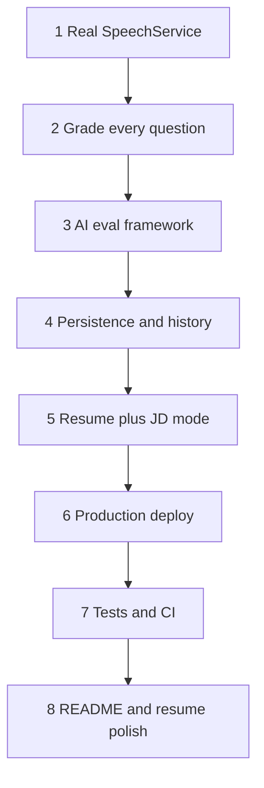

# InterviewPilot Roadmap: Actionable Breakdown

The roadmap’s point is not “add more AI features.” It is to make the existing mock-interview product **honest, measurable, and defensible in a job interview**. Right now the app already has a live Gemini voice interviewer, in-browser eye-contact tracking, and a coaching report. Several pieces behind that UI are still fake, incomplete, or local-only.

Source roadmap: [InterviewPilot_Resume_Upgrade_Roadmap.md](InterviewPilot_Resume_Upgrade_Roadmap.md)

Recommended order: **fix fake analytics first**, then **grade fairly**, then **prove the AI scoring is not guesswork**, then persistence, then the one new product feature (resume + job description), then ship + tests + polish.

## Workstream checklist

- [ ] Replace stubbed SpeechService with deterministic WPM/filler/timing metrics and surface them on results
- [ ] Grade every interview question with structured score/evidence/feedback and aggregate overall score
- [ ] Add labeled dataset + eval runner + MAE/consistency/parse-failure metrics under `/evals`
- [ ] Add Postgres, auth, saved sessions, history page, and progress-over-time view
- [ ] Personalize interview plans from resume + job description extraction
- [ ] Production CORS/env, safe keys, hosted frontend+API, full-flow demo
- [ ] Pytest + targeted frontend tests + GitHub Actions badge
- [ ] Update README/architecture/demo and remove stale known limitations

---

## 1. Replace the stubbed SpeechService

**What it aims to do:** Stop lying about speech stats. The results pipeline should compute real speaking-pace, filler, and timing numbers from the interview instead of returning hardcoded values.

**Current state:** [`backend/services/speech.py`](backend/services/speech.py) ignores the transcript and always returns `filler_count=12`, `WPM=142`, `speech_score=71.5`. The live HUD in [`app/page.tsx`](app/page.tsx) already counts fillers and WPM on the client, but those numbers are **not sent** to `/api/analyze`, and the results screen does not show the backend speech/presence scores.

**Actionable steps:**

- Define the real metrics and formulas (WPM, filler list including phrases like “you know”, duration, pauses if possible, repetition, latency, optional verbosity).
- Implement `SpeechService.score()` as deterministic Python over the transcript (and extra timing fields if needed). No LLM for this.
- Extend [`AnalyzeInput`](backend/schemas.py) if wall-clock duration is not enough (e.g. send `user_speaking_seconds` or per-turn timestamps from [`useLiveAPI`](app/hooks/useLiveAPI.ts)).
- Show the same speech numbers on the results screen that the HUD showed live, so client and server agree.
- Add a few unit tests for filler/WPM edge cases while you are in this file (cheap, and you will need them later for CI).

**Simple why:** Recruiters will look at the code. Hardcoded `12` fillers is an immediate red flag. Real speech math is also the easiest way to show engineering beyond “I called Gemini.”

---

## 2. Fix grading for every interview question

**What it aims to do:** Every question the interviewer asked should get its own score, evidence, and feedback. The overall score should be an average (or weighted blend) of those, plus speech/presence — not a vague essay about only Q1 and Q2.

**Current state:** [`CoachService`](backend/services/coach.py) puts only the first two questions in the prompt. The UI allows 1–5 questions. Output is one `confidence_score` plus 3 strengths / 3 improvements — no per-question structure.

**Actionable steps:**

- Change the coach schema so each question produces: score, rubric evidence, short feedback.
- Pass **all** `payload.questions` into the prompt.
- Aggregate those scores into the overall interview score (keep speech/presence as separate signals).
- Update [`app/lib/api.ts`](app/lib/api.ts) and the results UI to list per-question grades.

**Simple why:** If a user does a 4-question interview, grading two of them is a known bug. Fixing it is a small schema + prompt change with high credibility.

---

## 3. Build an AI evaluation framework

**What it aims to do:** Prove the grader is not a vibes-based LLM. You keep a labeled set of sample answers, run the coach against them, and measure how close it is to human scores — then use that to improve prompts.

**Current state:** No `/evals` folder, no dataset, no runner.

**Actionable steps:**

- Create `/evals` with `dataset.json` (~50–100 answers: question, answer, human scores for relevance/specificity/structure/communication).
- Write `run_eval.py` that sends each sample through the same structured coach path used in production.
- Write `metrics.py`: agreement with labels, mean absolute error, run-to-run consistency, JSON parse failures, latency, rough cost.
- Save results under `/evals/results` so you can compare prompt/model versions (Prompt A MAE 1.12 vs Prompt B 0.71).
- Optionally use a couple of eval failures to tighten the coach prompt (that is the point of the loop).

**Simple why:** This is the highest-leverage “AI engineer” story. In interviews you can say: “I did not trust the model; I measured it.”

---

## 4. Add persistence + interview history

**What it aims to do:** Interviews should survive a refresh. Users (even just you, at first) should see past sessions and whether eye contact, WPM, fillers, and overall score improved over time.

**Current state:** Everything lives in React state. No database, no auth.

**Actionable steps:**

- Pick Postgres (Supabase is the roadmap’s simple option).
- Design tables: `users`, `interviews`, `questions`, `responses`, `speech_metrics`, `presence_metrics`, `scores`, `feedback`.
- Add auth (email/magic link is enough).
- On analyze, write the session instead of only returning JSON.
- Add a history page and a session-detail page.
- Add a small progress view (week 1 vs week 4 style).

**Simple why:** This is the full-stack / backend-design proof. Without it the product looks like a demo tab, not an app.

**Note:** The roadmap lists this before resume/JD mode and before deploy. If time is tight, the “minimum upgrade” set skips this and jumps to deploy after evals.

---

## 5. Resume + job description interview mode

**What it aims to do:** Questions should come from **this candidate’s resume** and **this job’s requirements**, not generic role/vibe dropdowns.

**Current state:** Setup is role, vibe, style, difficulty, question count only ([`SetupInput`](backend/schemas.py)).

**Actionable steps:**

- Add resume upload/paste + job-description paste on setup.
- Extract structured skills/experience/requirements (LLM with a strict schema).
- Feed that into [`PlannerService`](backend/services/planner.py) so the plan mixes behavioral, project deep-dive, technical, and follow-ups grounded in the resume.
- Keep this as the **only** major new user-facing feature.

**Simple why:** It makes the core product better. Extra chatbots or cover-letter tools would dilute the story.

---

## 6. Deploy InterviewPilot

**What it aims to do:** A recruiter can click a live demo instead of cloning the repo.

**Current state:** CORS is `http://localhost:3000` only ([`backend/main.py`](backend/main.py)). Frontend Gemini key is `NEXT_PUBLIC_*` (browser-exposed). No production CORS/env, no Docker/Vercel backend wiring. README links to a missing `ARCHITECTURE.md`.

**Actionable steps:**

- Move privileged Gemini usage behind the backend; do not ship a privileged key in the browser if you can avoid it (Live API may still need a constrained client token — design that carefully).
- Env-drive CORS origins; fail closed if AI keys/services are missing.
- Deploy frontend (Vercel) + FastAPI + Postgres.
- Walk the full flow in a clean browser: mic, camera, plan, interview, analyze, results.
- Put Live Demo / GitHub / Demo Video links at the top of the README.

**Simple why:** Un-runnable projects get skipped. Deploy also forces you to fix the localhost-only corners.

---

## 7. Automated tests + CI

**What it aims to do:** Every push proves the deterministic pieces still work: speech math, presence math, score aggregation, schema validation, and “Gemini returned garbage / was down.”

**Current state:** `npm run lint` only. No pytest, no frontend test runner, no `.github/workflows`.

**Actionable steps:**

- Pytest for [`SpeechService`](backend/services/speech.py), [`PresenceService`](backend/services/presence.py), scoring aggregation, invalid payloads, mocked Gemini failures.
- Frontend tests only where they protect real logic (API types, metric helpers), not a huge UI suite.
- GitHub Actions: lint → typecheck → frontend tests → pytest → build.
- Add a passing CI badge to the README.

**Simple why:** Shows you treat this like production software. The service split already makes this cheap if you do not postpone it forever.

---

## 8. Final README and resume polish

**What it aims to do:** Present the *finished* engineering story: screenshot, architecture, eval numbers, live demo, honest tech stack. Delete stale “known limitations” once they are gone.

**Current state:** README still advertises stubbed speech, first-two-question grading, no persistence, localhost CORS. `ARCHITECTURE.md` is linked but missing.

**Actionable steps:** One-sentence pitch, screenshot/GIF, demo links, architecture diagram, eval table, setup + test instructions, resume bullets that match what you actually built.

**Simple why:** Do this last so you do not document a product you then change.

---

## If time is limited

- **Minimum (before applications):** 1 speech + 2 grade-all-questions + 3 evals + 6 deploy.
- **Strong:** add 4 persistence and 7 CI.
- **Ideal:** add 5 resume/JD mode and 8 polish.

**Do not spend time on:** generic chat, cover letters, extra interview modes, animation, or “another prompt.” Depth on speech, grading, evals, and shipping beats a longer feature list.

---

## Suggested first implementation slice

The first slice is **step 1 only**: real `SpeechService`, aligned client/server metrics, results UI that shows them, and a handful of unit tests. Step 2 (per-question grading) is the natural follow-up in the same analyze pipeline.
